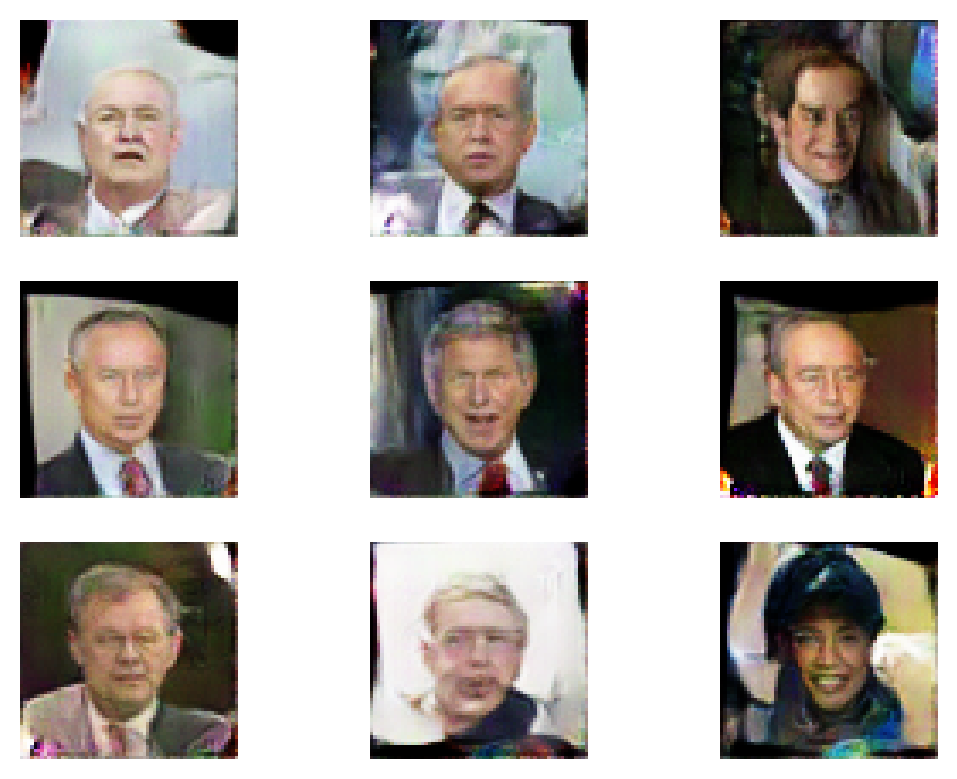

# DCGAN-LFW

## Dataset

Please download the Labelled Faces in the Wild (LFW) dataset from https://www.kaggle.com/jessicali9530/lfw-dataset. Copy the innermost `lfw-deepfunneled` directory to the root of this repository.

## To Train

```bash
python3 train.py
```

## To Run Demo

First make sure generator and discriminator are saved to the disk. The models will be saved every epoch of training. Then run,

```bash
streamlit run demo.py
```

## Sample Output

